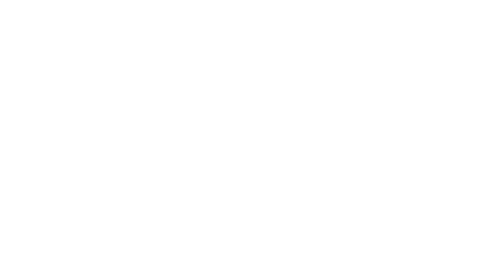
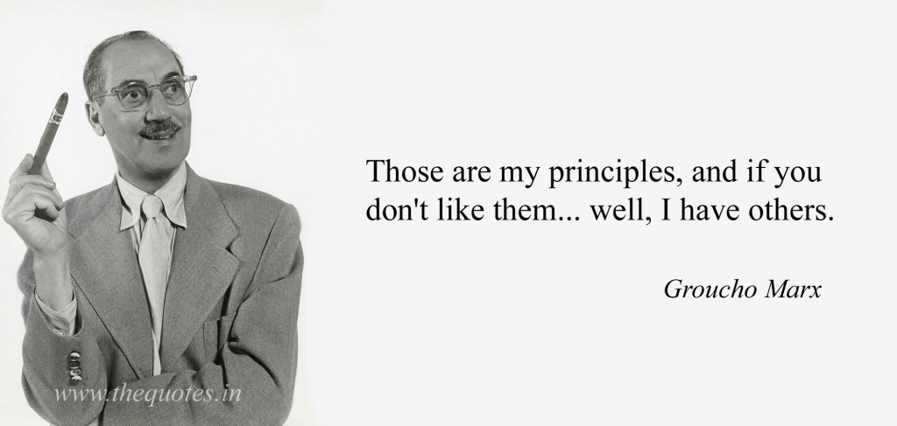

class: middle, center, title-slide

# how not to design
# a state machine


.author[Adrien Di Pasquale  - paris.rb 05/07/2016]



---

class: middle, center, invert, bigsm

### Movie


---

```bash
# Gemfile

gem 'state_machine'
# or gem 'state_machines-activerecord'
```


```rb
class Movie
  state_machine :state, :initial => :in_production do

    event :finish_shooting do
      transition :in_production => :in_theaters
    end

  end
end
```

```bash
$ rake state_machine:draw ...
```

---

name: intro

## intro

- startup context

???

- I will not speak of SM theory & research nor about integrated circuits.
- in a startup, SMs give structure to the code and to the whole team dynamic.

---

name: intro2
template: intro

- very structuring

???

- goals are :
  - simple so it's easy to grasp for everyone, not only tech. it helps a lot when languages align.
  - rational for developers to work with
  - easy to update with product evolutions

---

template: intro2

- ∞ valid choices

???

the hard thing is that is no magic method to reach these goals. there is an infinity of possible and valid choices. you can make the product work with any of these designs


---

class: middle, center

# 4 tips to failure

---

class: center

.header[how to fail : tip n°1]

## decide everything on your own

???

- corrolary : don't let your CTO or anyone else decide on his own
- listen to many people so you understand point of views. look how they interact with the data.
- ~imagine upcoming usecases.
- it takes time
- try and look for a consensus
- listening to your gut can help though

---

class: center, invert, twostates

### Netflix Movie

- Supply 
- .supply[]


- Marketing 
- 


---

class: center

.header[how to fail : tip n°2]

## look for universal truth


???

- do not think you can reach the truth. there are multiple truthes, each team (and maybe even each team member) can view the data differently.
- the truth will evolve as the product evolves
- sub objects may appear
- compromise for things you're not sure of, make the least engaging choice

---

class: center

.header[how to fail : tip n°3]

## anticipate the future


???

- you can orient it a little bit in the direction you want it to take for later
- usually, the least states, the easier it will later be to migrate the data.


---
class: center

.header[how to fail : tip n°4]

## store nothing but the state

???

-
- store all transitions, up to the last one.
- will help migrating, and investigating what happened.

---

class: middle, center, full


